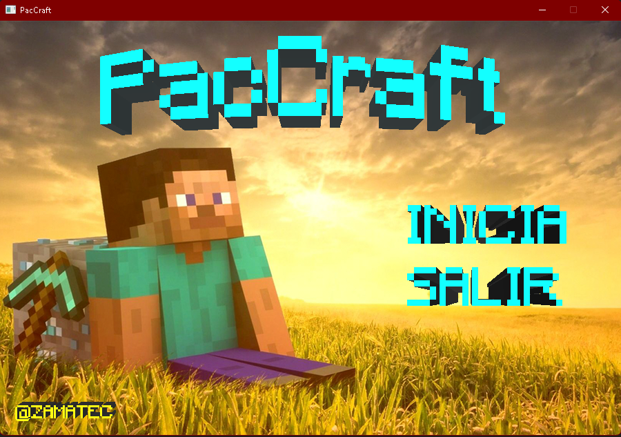
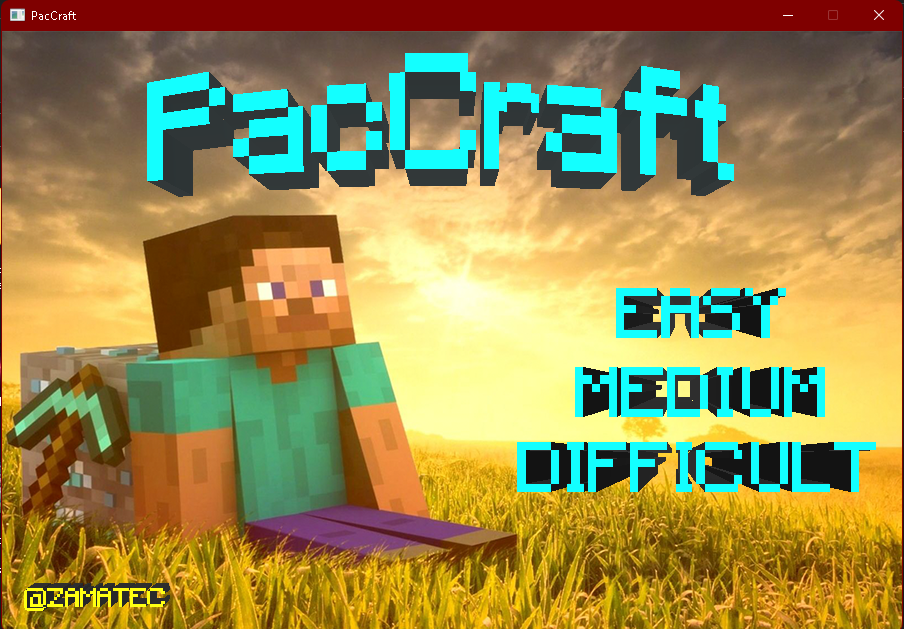
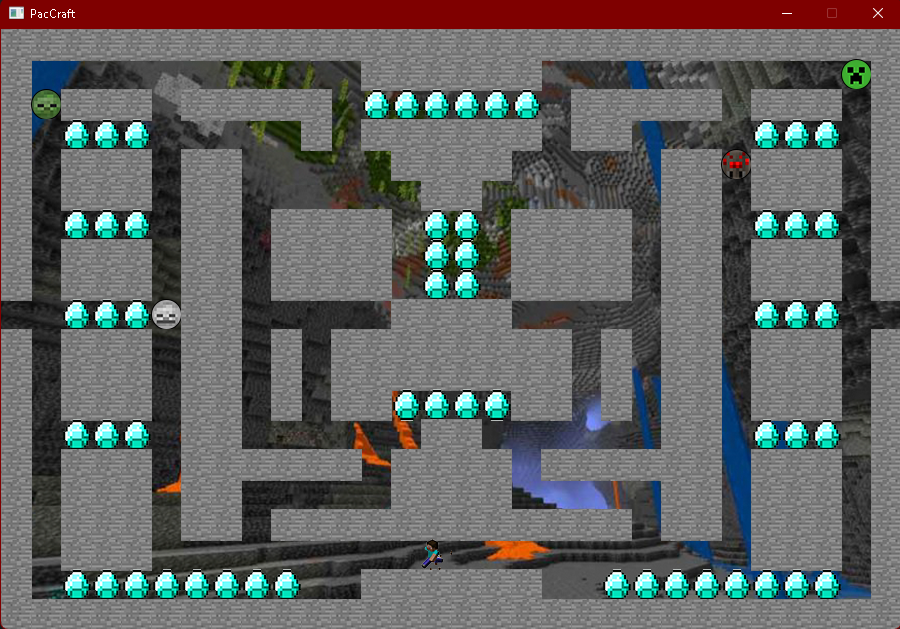
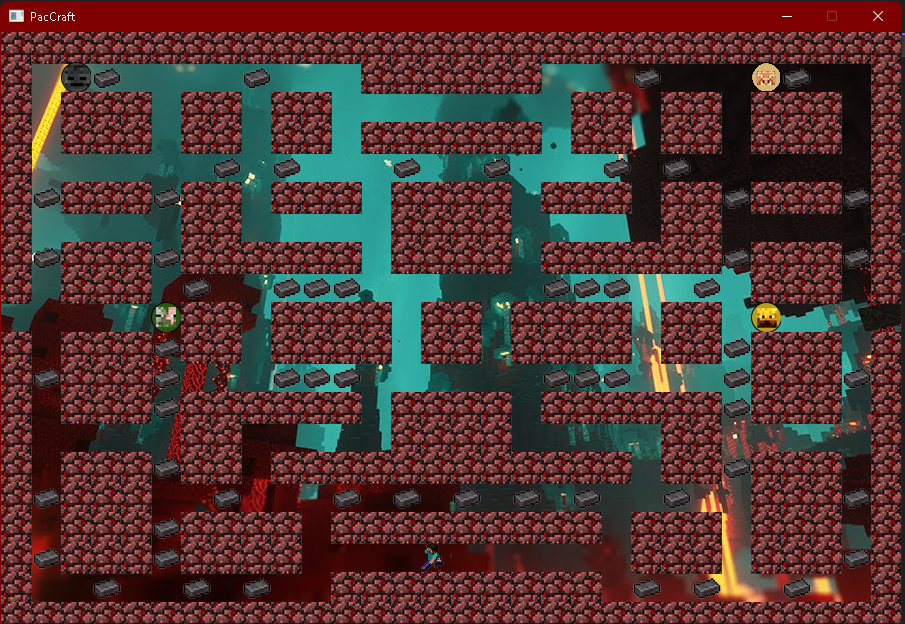
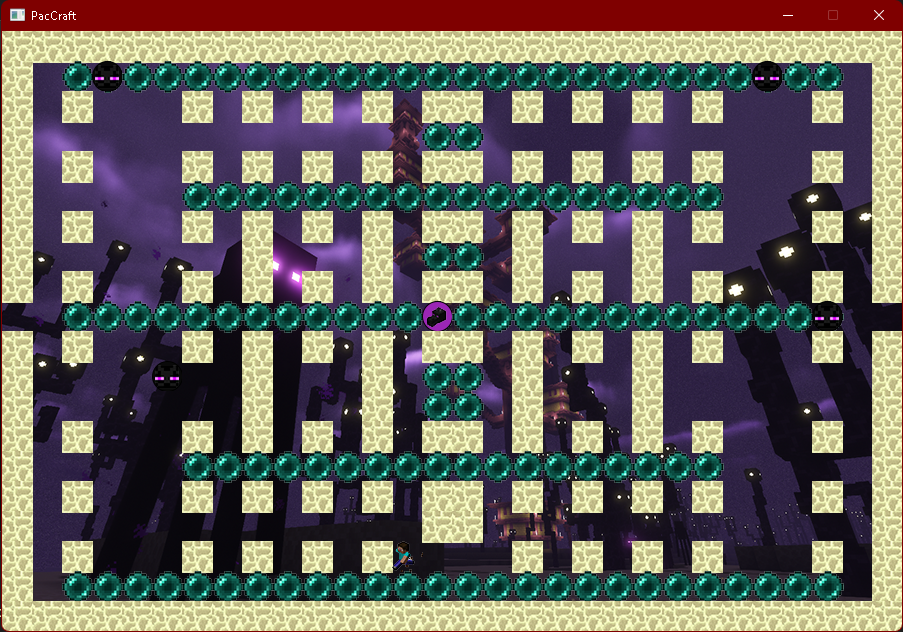

# Información

El juego fue creado, usando el lenguaje C++ y la Librería de Allegro 5 para implementar texturas, sonidos, entre otras funciones, es un juego creado bajo la lógica del juego PacMan usando diferentes texturas al estilo Minecraft.

Se cuenta con 2 interfaces de usuario distintas empezando por la de inicio principal, teniendo música de fondo y la siguiente un menú para elegir la dificultad que desea elegir igualmente cuenta con música de fondo.

Contamos con sonidos a la hora de agarrar los items, se cuenta con un codigo modificable por si quieres que cada vez que te maten todo lo que hayas recogido vuelva aparecer.

# Menú Inicial

# Menú Dificultades
Contamos con 3 mapas diferentes Fácil, Medio y Difícil, cada mapa cuenta con música ambiente, enemigos diferentes y texturas diferentes.

# Mapa Fácil

# Enemigos del Mapa Fácil
En el Mapa Fácil contamos con 4 enemigos diferentes siendo Zombi, Esqueleto, Creeper y Araña.

# Mapa Medio

# Enemigos del Mapa Medio
En el Mapa Medio contamos con 4 enemigos diferentes siendo Piglin, Zombi Piglin, Esqueleto Whiter y Blaze.

# Mapa Difícil

# Enemigos del Mapa Difícil
En el Mapa Difícil contamos con 2 enemigos diferentes siendo Enderman y Ender Dragón, en este caso el Enderman está 4 veces y el Ender Dragón 1 sola vez siendo así 5 enemigos en el mapa.

