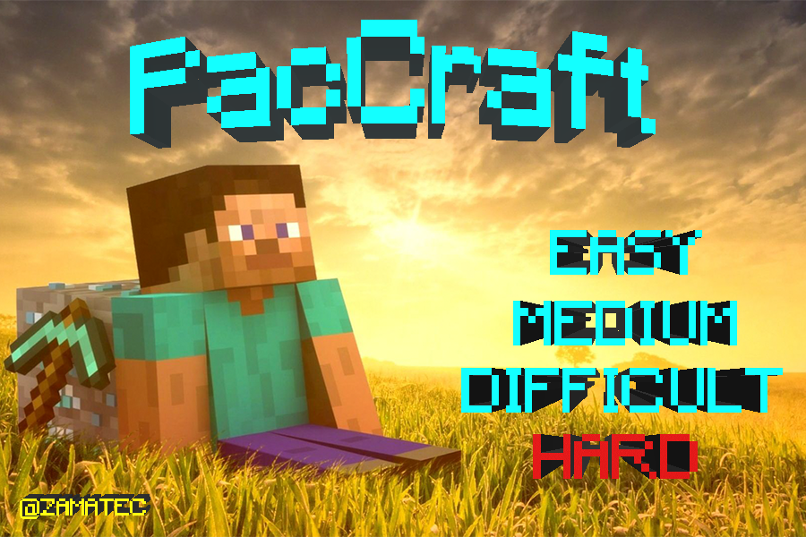
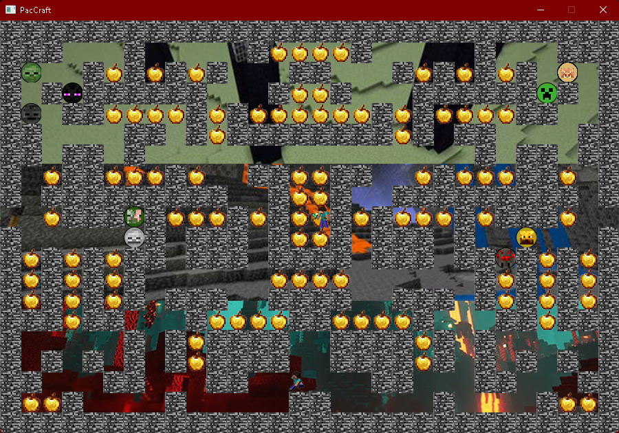
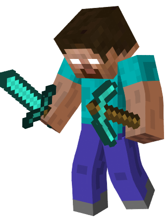

 
  <b>Visits/b>
   
  

# Información

El juego fue creado, usando el <b>lenguaje C++</b> y la Librería de <b>Allegro 5</b> para implementar texturas, sonidos, entre otras funciones, es un juego creado bajo la lógica del juego <b>PacMan</b> usando diferentes texturas al estilo <b>Minecraft</b>.

Se cuenta con 2 interfaces de usuario distintas empezando por la de <b>Inicio</b> principal, teniendo <b>Música</b> de fondo y la siguiente un <b>Menú</b> para elegir la <b>Dificultad</b>, igualmente cuenta con <b>Música</b> de fondo.

Contamos con <b>Sonidos</b> a la hora de agarrar los <b>Items</b>, se cuenta con un <b>Codigo Modificable</b> por si quieres que en cada mapa cuando te <b>Maten</b> todo lo que hayas <b>Recogido</b> vuelva a <b>Aparecer</b>, esta funcion viene activada por defecto en el <b>Mapa Hard</b>.

# Menú Inicial
Se cuanta con dos diferentes opciones siendo la primera la de <b>Inicio</b>, esta nos llevara al menú de <b>Dificultades</b>, la segunda opción es la de <b>Salir</b>, esta simplemente cerrara el juego por completo.

# Menú Dificultades
Contamos con 4 mapas diferentes <b>Fácil</b>, <b>Medio</b>, <b>Difícultoso</b> y <b>Hard</b>, cada mapa cuenta con música ambiente, enemigos diferentes y texturas diferentes.

# Mapa Fácil
<b>Comida:</b> Diamantes.

Aunque sea el <b>Mapa Fácil</b> ten cuidado los enemigos pueden ser algo <b>Territoriales</b>.

# Enemigos del Mapa Fácil
En el Mapa Fácil contamos con 4 enemigos diferentes siendo <b>Zombi</b>, <b>Esqueleto</b>, <b>Creeper</b> y <b>Araña</b>.
 

  

# Mapa Medio
<b>Comida:</b> Netherite.

Ten cuidado al andar, <b>Concéntrate</b> en cada <b>Movimiento</b> que hagas... No querrás encontrarte sin salida

# Enemigos del Mapa Medio
En el Mapa Medio contamos con 4 enemigos diferentes siendo <b>Piglin</b>, <b>Zombi Piglin</b>, <b>Esqueleto Whiter</b> y <b>Blaze</b>.
 

 

# Mapa Difícultoso
<b>Comida:</b> Ender Perls.

No te confíes por que veas que tienes mucho <b>Espacio</b> para andar... No todo lo que se ve fácil puede serlo…

# Enemigos del Mapa Difícultoso
En el Mapa Difícultoso contamos con 2 enemigos diferentes siendo <b>Enderman</b> y <b>Ender Dragón</b>, en este caso el Enderman está 4 veces y el Ender Dragón 1 sola vez siendo así 5 enemigos en el mapa.
 

 

# Mapa Hard
<b>Comida:</b> Manzanas Doradas.

El Mapa Hard tiene la <b>Particularidad</b> de que a la hora de <b>Ser Golpeado/Matado</b> por un enemigo, todas las <b>Manzanas</b> que hayas agarrado <b>Volverán a Aparecer</b>... Así que será mejor que tengas mucho cuidado si quieres ganar...

Asegúrate de <b>Planear</b> una buena <b>Ruta</b> no querras encontrarte <b>Encerrado</b>, recuerda que tienes <b>10</b> enemigos que evadir...

# Enemigos del Mapa Hard
En el Mapa Hard contamos con <b>Todos los Enemigos</b> de los anteriores mapas, menos con el dragón siendo reemplazado por la mayor pesadilla de Minecraft... <b>Herobrine</b>.

 

# Nota Importante

El Proyecto del juego fue creado en <b>Visual Studio 2022</b>, en caso de querer usarlo o modificarlo a gusto, se le recomienda trabajarlo sobre Visual Studio 2022 <b>previniendo</b> así problemas de <b>compatibilidad</b>.
 
 
 
## Copyright (c) 2022 Mario Hernandez - [GitHub](https://github.com/Marioalf2002)
